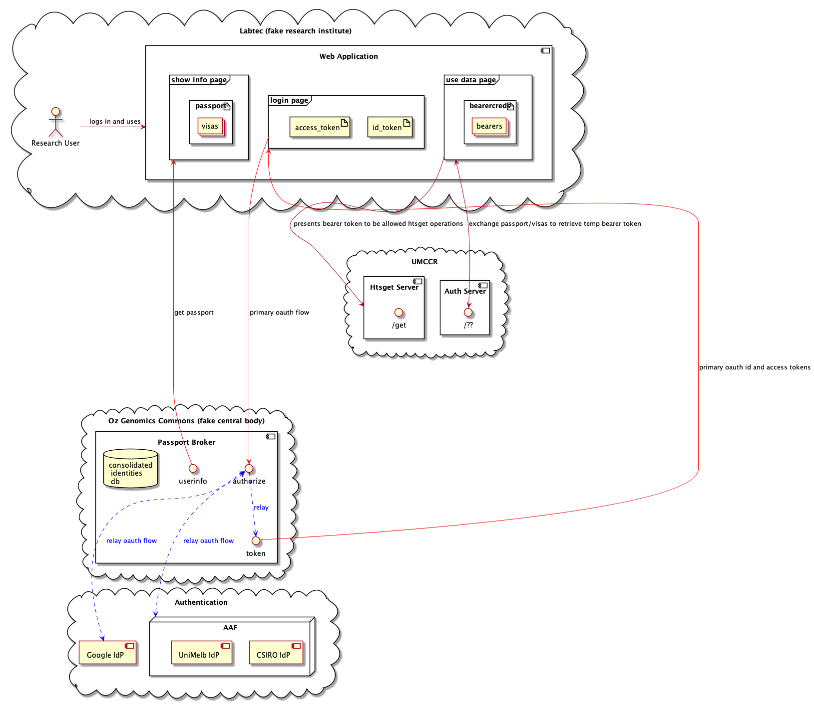
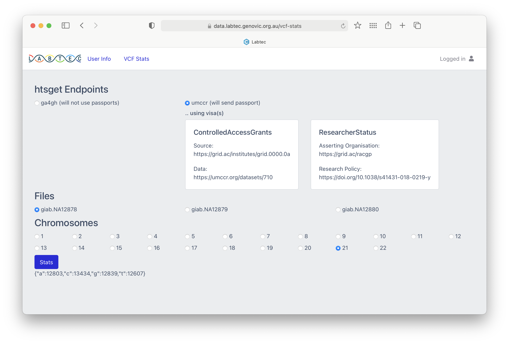

# GA4GH Htsget + Passport Demo

## Context

> This demo showcase one realization of GA4GH [Htsget](http://samtools.github.io/hts-specs/htsget.html) and AAI described [here](https://github.com/ga4gh/data-security/blob/master/AAI/README.md). This activity is part of [GA4GH FASP](https://www.ga4gh.org/genomic-data-toolkit/2020-connection-demos/) hackathon effort in Australia context.

- NOTE: Only public dataset `giab.NA12878.NIST7086.2` alignment reads and `giab.NA12878` variants [resource route](https://github.com/umccr/infrastructure/blob/master/cdk/apps/htsget/htsget/goserver.py#L449) is available through this experimental Htsget + Passport AuthZ.

- For current trusted Passport Brokers, see `TRUSTED_BROKERS` variable in [ppauthz.py](lambdas/ppauthz/ppauthz.py).

- You will need to have compliant Passport Visa Token from this list of trusted brokers; in order to call UMCCR *secured* htsget endpoints.
  
- You may try by getting Passport Visa Token from [Labtec](https://data.labtec.genovic.org.au) (Fake Researcher Portal) which run **_ASHA_** Passport Broker service. Please contact our collaborator [Andrew](https://github.com/andrewpatto) from https://www.melbournegenomics.org.au.

- If you are on GA4GH Slack, we are active in `#fasp` and `#lsg-htsget` channels. Or [ping us](https://umccr.org).

- Required `curl` and `jq`. On macOS, try like so: `brew install curl jq`

## AuthZ Flow
- At the mo, we have the following AuthZ flow for the showcase.

<details>
  <summary>Click to expand!</summary>

  
</details>

### Non-Passport User

- For those who only interested in Htsget, you may try public reference server directly by modifying two things:
    1. Use base URL: `https://htsget.ga4gh.org/` instead
    2. Remove Auth Bearer Header from the following `curl` commands

## Use Case: with Researcher Portal UI

- Once you are able to login to Labtec, you will be able to retrieve a particular region of `giab.NA12878` variants (VCF) through UMCCR Htsget Data service as follows.

<details>
  <summary>Click to expand!</summary>

  
</details>

## Use Case: with API

- First, get your Passport's Visa token from Labtec; the one with `Data: https://umccr.org/datasets/710` (tip: typically the first visa)

- Export this Visa token as follows:
```
export VISA_TOKEN=eyJ0eXAiOiJKV1QiLC[...shorten...it...for...brevity]tvE07D6g8sQ
```

### Alignment BAM Slice

- A call to htsget ID return the target alignment BAM sliced by 500MB. 
```
curl -s -H "Authorization: Bearer $VISA_TOKEN" "https://htsget.dev.umccr.org/reads/giab.NA12878.NIST7086.2" | jq
```

- Get Gene location / locus reference for [KRAS](https://en.wikipedia.org/wiki/KRAS)
```
curl -s https://igv.org/genomes/locus.php?genome=hg38&name=KRAS
KRAS	chr12:25205245-25250929	s3
```

- Get htsget ticket for KRAS slice
```
curl -s -H "Authorization: Bearer $VISA_TOKEN" "https://htsget.dev.umccr.org/reads/giab.NA12878.NIST7086.2?format=BAM&referenceName=chr12&start=25205245&end=25250929" | jq
```

- This return htsget ticket as follows:
```
{
  "htsget": {
    "format": "BAM",
    "urls": [
      {
        "url": "https://htsget.dev.umccr.org/reads/data/giab.NA12878.NIST7086.2",
        "headers": {
          "HtsgetBlockClass": "header",
          "HtsgetCurrentBlock": "0",
          "HtsgetTotalBlocks": "2"
        },
        "class": "header"
      },
      {
        "url": "https://htsget.dev.umccr.org/reads/data/giab.NA12878.NIST7086.2?end=25250929&referenceName=chr12&start=25205245",
        "headers": {
          "HtsgetCurrentBlock": "1",
          "HtsgetTotalBlocks": "2"
        },
        "class": "body"
      }
    ]
  }
}
```

- Fetch BAM header block (Note: data fetch endpoint is different `/reads/data/`)
```
curl -s -H "Authorization: Bearer $VISA_TOKEN" -H "HtsgetBlockClass: header" -H "HtsgetCurrentBlock: 0" -H "HtsgetTotalBlocks: 2"  "https://htsget.dev.umccr.org/reads/data/giab.NA12878.NIST7086.2" --output "giab.NA12878.NIST7086.2__kras__header.bam"
```

- Fetch BAM KRAS slice body block
```
curl -s -H "Authorization: Bearer $VISA_TOKEN" -H "HtsgetCurrentBlock: 1" -H "HtsgetTotalBlocks: 2" "https://htsget.dev.umccr.org/reads/data/giab.NA12878.NIST7086.2?end=25250929&referenceName=chr12&start=25205245" --output "giab.NA12878.NIST7086.2__kras__body.bam"
```

- Concatenate data blocks
```
cat giab.NA12878.NIST7086.2__kras__header.bam giab.NA12878.NIST7086.2__kras__body.bam > giab.NA12878.NIST7086.2__kras__slice.bam
```

- Check the size
```
wc -c giab.NA12878.NIST7086.2__kras__header.bam
    2196 giab.NA12878.NIST7086.2__kras__header.bam

wc -c giab.NA12878.NIST7086.2__kras__body.bam
    102939 giab.NA12878.NIST7086.2__kras__body.bam

wc -c giab.NA12878.NIST7086.2__kras__slice.bam
    105135 giab.NA12878.NIST7086.2__kras__slice.bam
```

- View the KRAS sliced BAM using `samtools`
```
samtools flagstats giab.NA12878.NIST7086.2__kras__slice.bam

    1380 + 0 in total (QC-passed reads + QC-failed reads)
    0 + 0 secondary
    0 + 0 supplementary
    67 + 0 duplicates
    1379 + 0 mapped (99.93% : N/A)
    1380 + 0 paired in sequencing
    689 + 0 read1
    691 + 0 read2
    1290 + 0 properly paired (93.48% : N/A)
    1378 + 0 with itself and mate mapped
    1 + 0 singletons (0.07% : N/A)
    0 + 0 with mate mapped to a different chr
    0 + 0 with mate mapped to a different chr (mapQ>=5)
```

```
samtools index giab.NA12878.NIST7086.2__kras__slice.bam

wc -c giab.NA12878.NIST7086.2__kras__slice.bam.bai
    13160 giab.NA12878.NIST7086.2__kras__slice.bam.bai

samtools idxstats giab.NA12878.NIST7086.2__kras__slice.bam | less
```

```
samtools view -h giab.NA12878.NIST7086.2__kras__slice.bam | less
```

### Variant VCF Slice

- A call to htsget ID return the target variant VCF ranges. 
```
curl -s -H "Authorization: Bearer $VISA_TOKEN" "https://htsget.dev.umccr.org/variants/giab.NA12878" | jq
```

- Get ticket for Region 1. Response contains header block and body block for client to fetch.
```
curl -s -H "Authorization: Bearer $VISA_TOKEN" "https://htsget.dev.umccr.org/variants/giab.NA12878?format=VCF&referenceName=1&start=0&end=57224045" | jq
```

> Here, `referenceName=1` is equal to `bcftool view --region N` flag, behind the scene.

- This return htsget ticket as follows:
```
{
  "htsget": {
    "format": "VCF",
    "urls": [
      {
        "url": "https://htsget.dev.umccr.org/variants/data/giab.NA12878",
        "headers": {
          "HtsgetBlockClass": "header",
          "HtsgetCurrentBlock": "0",
          "HtsgetTotalBlocks": "2"
        },
        "class": "header"
      },
      {
        "url": "https://htsget.dev.umccr.org/variants/data/giab.NA12878?end=57224045&referenceName=1&start=0",
        "headers": {
          "HtsgetCurrentBlock": "1",
          "HtsgetTotalBlocks": "2"
        },
        "class": "body"
      }
    ]
  }
}
```

- Fetch header block (Note: data fetch endpoint is different `/variants/data/`)

```
curl -s -H "Authorization: Bearer $VISA_TOKEN" -H "HtsgetBlockClass: header" -H "HtsgetCurrentBlock: 0" -H "HtsgetTotalBlocks: 2" -X GET "https://htsget.dev.umccr.org/variants/data/giab.NA12878" --output "giab.NA12878__header.vcf"
```

- Fetch body block

```
curl -s -H "Authorization: Bearer $VISA_TOKEN" -H "HtsgetBlockClass: header" -H "HtsgetCurrentBlock: 1" -H "HtsgetTotalBlocks: 2" -X GET "https://htsget.dev.umccr.org/variants/data/giab.NA12878?end=57224045&referenceName=1&start=0" --output "giab.NA12878__body.vcf"
```

- Assemble the blocks
```
cat giab.NA12878__header.vcf giab.NA12878__body.vcf > giab.NA12878__ref1.vcf
```

- Check the size
```
wc -c giab.NA12878__header.vcf
    5724 giab.NA12878__header.vcf
    
wc -c giab.NA12878__body.vcf
    27594276 giab.NA12878__body.vcf

wc -c giab.NA12878__ref1.vcf
    27600000 giab.NA12878__ref1.vcf
```

- Check/view them with `bcftools`
```
bcftools stats giab.NA12878__ref1.vcf | less
bcftools view giab.NA12878__ref1.vcf | less
```

### Header Class Only

> Note that you can also query "header" only for VCF/BAM

- Get htsget ticket for VCF header only
```
curl -s -H "Authorization: Bearer $VISA_TOKEN" "https://htsget.dev.umccr.org/variants/giab.NA12878?class=header" | jq

{
  "htsget": {
    "format": "VCF",
    "urls": [
      {
        "url": "https://htsget.dev.umccr.org/variants/data/giab.NA12878?class=header",
        "headers": {
          "HtsgetBlockClass": "header",
          "HtsgetCurrentBlock": "0",
          "HtsgetTotalBlocks": "1"
        },
        "class": "header"
      }
    ]
  }
}
```

- Fetch VCF header
```
curl -s -H "Authorization: Bearer $VISA_TOKEN" -H "HtsgetBlockClass: header" -H "HtsgetCurrentBlock: 0" -H "HtsgetTotalBlocks: 1" -X GET "https://htsget.dev.umccr.org/variants/data/giab.NA12878?class=header" --output "giab.NA12878__header__only.vcf"
```

- Check file size
```
wc -c giab.NA12878__header__only.vcf
    5724 giab.NA12878__header__only.vcf
```

- View VCF headers
```
bcftools view -h giab.NA12878__header__only.vcf | less
```

## Further Research

- Htsget IDs carting (or dataset bundle) -- _one to connect to DRS?_
- Passport Container and/or Passport Visa token down-scoping?
- DRS + Passport -- _happening as part of [Gen3 Data Commons implementation](https://github.com/umccr/gen3-doc/blob/main/workshop/2021-05-21.md)_
