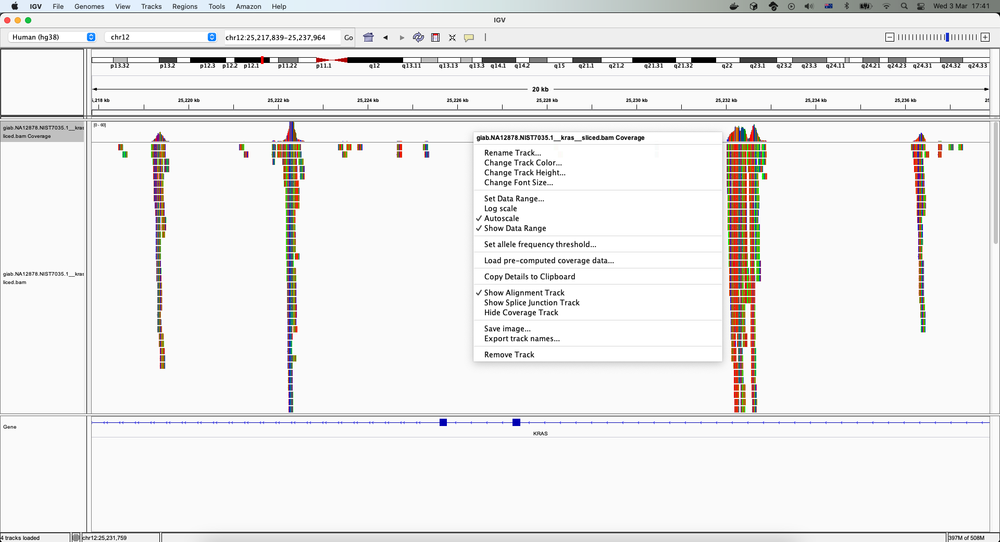
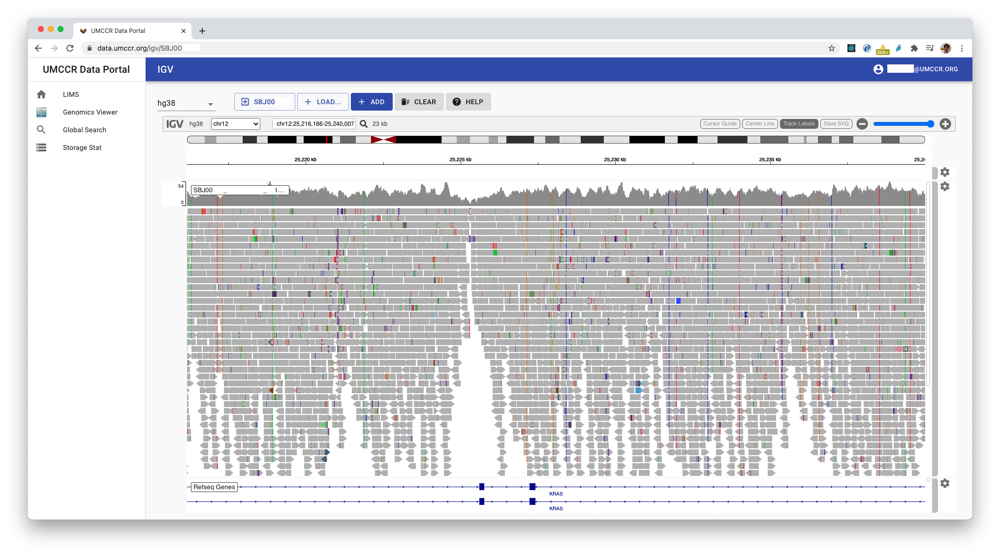

# htsget-refserver 

UMCCR Deployment of [`htsget-refserver`](https://github.com/ga4gh/htsget-refserver) implementation

## TL;DR

```
pip install -r requirements.txt

cdk list
cdk diff
cdk synth
cdk deploy
cdk destroy
```

## Architecture
```
        GA4GH Passport                       GA4GH htsget
  ACM        |                                     |
   |   (Lambda Authz)         |           (private subnets)
Route53 > APIGWv2 > VpcLink > | ALB > (autoscaling) ECS Fargate Cluster
                              |
```

Architecture very similar to this article:
- [Access Private applications on AWS Fargate using Amazon API Gateway PrivateLink](https://aws.amazon.com/blogs/compute/access-private-applications-on-aws-fargate-using-amazon-api-gateway-privatelink/).
- [Configuring private integrations with Amazon API Gateway HTTP APIs](https://aws.amazon.com/blogs/compute/configuring-private-integrations-with-amazon-api-gateway-http-apis/)


## Prerequisites

Need to prepare the following SSM parameters in given AWS account.

- ACM SSL Certificate ARN at: `/htsget/acm/apse2_arn`
- Domain Name at: `/htsget/domain`
- Route53 Hosted Zone Name at: `/hosted_zone_name`
- Route53 Hosted Zone ID at: `/hosted_zone_id`

## Config

`htsget-refserver` [Config JSON](https://github.com/ga4gh/htsget-refserver#configuration) is stored as AWS SSM parameter.

Parameter store key is at: `/htsget/refserver/config`

Using CLI:
```
aws ssm get-parameter --name '/htsget/refserver/config' --output text --query Parameter.Value
```

Alternatively, use AWS SSM Console UI.

#### Updating Config

1. Update new config in parameter store
    ```
    aws ssm put-parameter --name '/htsget/refserver/config' --type String --tier Advanced --value file://config/dev.json --overwrite
    ```
2. Terminate any existing running `htsget-refserver` main containers

## Private Bucket

(service to service authz)

- The stack creates [a dedicated ECS task role](https://github.com/umccr/infrastructure/blob/master/cdk/apps/htsget/htsget/goserver.py#L130) (IAM role) which allow secured data access to private S3 bucket.
- The `htsget-refserver` behind the scene utilise [htslib AWS S3 plugin](http://www.htslib.org/doc/htslib-s3-plugin.html) for loading credentials.
- Therefore, it is required to [turn on `awsAssumeRole` middleware](https://github.com/victorskl/htsget-refserver/tree/cors-support#configuration---props-object) request interceptor to support AWS [Assume Role](https://docs.aws.amazon.com/STS/latest/APIReference/API_AssumeRole.html) temporary security credentials loading to access [S3 private bucket](https://github.com/victorskl/htsget-refserver/tree/cors-support#private-bucket).

## Client AuthZ

- Currently, there are two authorization possible from a client API calls to htsget api gateway endpoint:
  1. Cognito JWT
  2. Passport Visa JWT

### AuthZ: Cognito JWT

(client to htsget api gateway endpoint)

- Within UMCCR workflow and, especially [Data Portal client](https://github.com/umccr/data-portal-client), we use API Gateway [JWT Authorizer](https://docs.aws.amazon.com/apigateway/latest/developerguide/http-api-jwt-authorizer.html) that integrate with [Cognito User Pool as authorizer](https://docs.aws.amazon.com/apigateway/latest/developerguide/apigateway-integrate-with-cognito.html) i.e. Cognito acts as OIDC/OAuth broker provider.
- This makes it seamlessly possible since our Data Portal client make use of [Amplify React](https://aws.amazon.com/blogs/mobile/building-an-application-with-aws-amplify-amazon-cognito-and-an-openid-connect-identity-provider/) to generate short live JWT on-the-fly for those federated login identities/users.
- With short-live Bearer JWT authorization, client can make a call to the secured htsget API Gateway endpoint to access the private resources.


### AuthZ: GA4GH Passport (Experiment)

(client to htsget api gateway endpoint)

> See [HTSGET_PASSPORT.md](HTSGET_PASSPORT.md) for User Guide

- [GA4GH Passport Clearinghouse](https://github.com/ga4gh-duri/ga4gh-duri.github.io/blob/master/researcher_ids/ga4gh_passport_v1.md) is implemented as AWS API Gateway v2's [Lambda Authorizer](https://docs.aws.amazon.com/apigateway/latest/developerguide/http-api-lambda-authorizer.html). 

- See [PR #101](https://github.com/umccr/infrastructure/pull/101) for initial commit comment summary.

- **TL;DR** for passport clearing house development workflow:
    ```
    make test
    make deploy
    ```

- This lambda authorizer Python module is inside [lambdas/ppauthz](lambdas/ppauthz).

- To run tests:
  
    **TL;DR:**
    ```
    make test
    ```

    **TS;WM:**
    ```
    cd lambdas/ppauthz
    python -m unittest
    python -m unittest test_ppauthz.PassportAuthzUnitTest.test_handler
    python -m unittest test_ppauthz.PassportAuthzIntegrationTest.test_handler_it
    ```
    > 🙋‍♂️Read more in the PyDoc string!

- If you update this [lambdas/requirements.txt](lambdas/requirements.txt) file:
  
    **TL;DR:**
    ```
    make refresh_deploy
    ```
  
    **TS;WM:**
    If you update Lambda Python dependency, make sure to delete [lambdas/.build](lambdas/.build) staging directory. Before applying `cdk diff && cdk deploy`. Makefile `refresh_deploy` target automate this workflow.
    
    > 🙋‍♂️ Lambda Python dependency is packaged and deployed as Lambda Layer. It contains **platform dependant cryptography** library. Hence, required AWS Lambda Docker image to build and packaging it!

## FAQ

### Compose Stack

**Q**. Is there docker compose that I could ran on my local to quick demo htsget-refserver?

**A**. Yes. Our [Data Portal client](https://github.com/umccr/data-portal-client) use this htsget-refserver backend and, hence, we have docker compose ready for local dev purpose as follows:

  - [docker-compose.yml](https://github.com/umccr/data-portal-client/blob/dev/docker-compose.yml)
  - [htsget-config-local.json](https://github.com/umccr/data-portal-client/blob/dev/htsget-config-local.json)

```
wget https://raw.githubusercontent.com/umccr/data-portal-client/dev/docker-compose.yml
wget https://raw.githubusercontent.com/umccr/data-portal-client/dev/htsget-config-local.json
yawsso login --profile dev --this
export AWS_PROFILE=dev
docker-compose up -d
curl -s http://localhost:3100/reads/service-info | jq
```

### Htsget 101

- A call to htsget ID return the target alignment BAM sliced by 500MB. 
```
curl -s http://localhost:3100/reads/giab.NA12878.NIST7035.1 | jq
```

- Get Gene location / locus reference for [KRAS](https://en.wikipedia.org/wiki/KRAS)
```
curl -s https://igv.org/genomes/locus.php?genome=hg38&name=KRAS
KRAS	chr12:25205245-25250929	s3
```

- Get KRAS slice
```
curl -s http://localhost:3100/reads/giab.NA12878.NIST7035.1?format=BAM&referenceName=chr12&start=25205245&end=25250929 | jq
```

- Return htsget ticket
```
{
  "htsget": {
    "format": "BAM",
    "urls": [
      {
        "url": "http://localhost:3100/reads/data/giab.NA12878.NIST7035.1",
        "headers": {
          "HtsgetBlockClass": "header",
          "HtsgetCurrentBlock": "0",
          "HtsgetTotalBlocks": "2"
        },
        "class": "header"
      },
      {
        "url": "http://localhost:3100/reads/data/giab.NA12878.NIST7035.1?end=25250929&referenceName=chr12&start=25205245",
        "headers": {
          "HtsgetCurrentBlock": "1",
          "HtsgetTotalBlocks": "2"
        },
        "class": "body"
      }
    ]
  }
}
```

- Get KRAS slice header
```
curl -s -H "HtsgetBlockClass: header" -H "HtsgetCurrentBlock: 0" -H "HtsgetTotalBlocks: 2"  http://localhost:3100/reads/data/giab.NA12878.NIST7035.1 --output giab.NA12878.NIST7035.1__kras__header.bam
```

- Get KRAS slice body
```
curl -s -H "HtsgetCurrentBlock: 1" -H "HtsgetTotalBlocks: 2" http://localhost:3100/reads/data/giab.NA12878.NIST7035.1\?end\=25250929\&referenceName\=chr12\&start\=25205245 --output giab.NA12878.NIST7035.1__kras__body.bam
```

- Concatenate data blocks
```
cat giab.NA12878.NIST7035.1__kras__header.bam giab.NA12878.NIST7035.1__kras__body.bam > giab.NA12878.NIST7035.1__kras__sliced.bam
```

- Check the size
```
wc -c giab.NA12878.NIST7035.1__kras__header.bam
    2195 giab.NA12878.NIST7035.1__kras__header.bam

wc -c giab.NA12878.NIST7035.1__kras__body.bam
   92798 giab.NA12878.NIST7035.1__kras__body.bam

wc -c giab.NA12878.NIST7035.1__kras__sliced.bam
   94993 giab.NA12878.NIST7035.1__kras__sliced.bam
```

- View the KRAS sliced BAM using `samtools`
```
samtools flagstats giab.NA12878.NIST7035.1__kras__sliced.bam

  1280 + 0 in total (QC-passed reads + QC-failed reads)
  0 + 0 secondary
  0 + 0 supplementary
  68 + 0 duplicates
  1280 + 0 mapped (100.00% : N/A)
  1280 + 0 paired in sequencing
  641 + 0 read1
  639 + 0 read2
  1173 + 0 properly paired (91.64% : N/A)
  1280 + 0 with itself and mate mapped
  0 + 0 singletons (0.00% : N/A)
  0 + 0 with mate mapped to a different chr
  0 + 0 with mate mapped to a different chr (mapQ>=5)
```

```
samtools index giab.NA12878.NIST7035.1__kras__sliced.bam

wc -c giab.NA12878.NIST7035.1__kras__sliced.bam.bai
   13232 giab.NA12878.NIST7035.1__kras__sliced.bam.bai

samtools idxstats giab.NA12878.NIST7035.1__kras__sliced.bam | less
```

```
samtools view -h giab.NA12878.NIST7035.1__kras__sliced.bam | less
```

- Or with IGV desktop




### How about data from a private S3 bucket?

> 🙋‍♂️ In [PR #24](https://github.com/ga4gh/htsget-refserver/pull/24) contains [commits](https://github.com/ga4gh/htsget-refserver/pull/24/commits/58b923a1709fdfd2e203229845b96bab468c491b) that add support for CORS, S3 protocol, Private Bucket and allow [embedding "/" character for htsget ID](http://samtools.github.io/hts-specs/htsget.html#url-parameters) -- which effectively allow [serving data from a private bucket](https://github.com/victorskl/htsget-refserver/tree/cors-support#private-bucket). See our [dev.json](config/dev.json) or [prod.json](config/prod.json) config for reference. Docker build from this branch avail in [hub](https://hub.docker.com/r/victorskl/htsget-refserver) and [quay](https://quay.io/repository/victorskl/htsget-refserver). 

> **UPDATE**: PR #24 is now merged. You may also use [GA4GH image](https://hub.docker.com/r/ga4gh/htsget-refserver) at `docker pull ga4gh/htsget-refserver:1.5.0`

- Hence, in our Portal client, we use [igv.js](https://github.com/igvteam/igv.js/) through htsget protocol to view BAM slices from a private S3 bucket.


