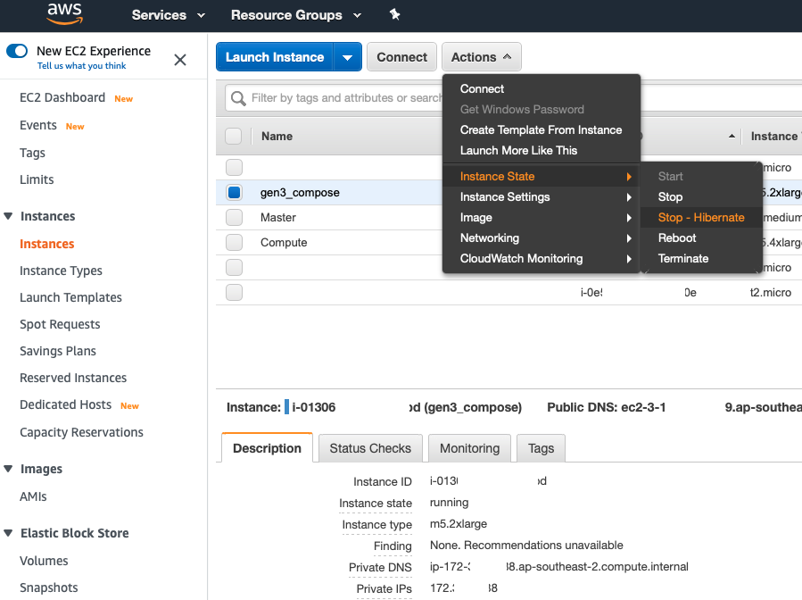

# Gen3

Login using your `<username>@umccr.org` at:

> https://gen3.dev.umccr.org/

The following are notes specific to our UMCCR setup. All Gen3 documentation should regards to material available at https://gen3.org.

## POC Setup

- POC setup use [hibernating EC2 instance](https://docs.aws.amazon.com/AWSEC2/latest/UserGuide/Hibernate.html) to house and run Gen3 [compose-services](https://github.com/uc-cdis/compose-services) docker stack.
- Login to AWS EC2 Console, and look for instance with Name tag "**gen3_compose**".
- Please hibernate the EC2 instance when not in use as follows. Otherwise you can start the instance to resume the process.



## Admin Guide

See [ADMIN.md](ADMIN.md)

## User Guide

### Create New Project

_aka Creating a new Project Resource Path under UMCCR program_

- Login to Gen3 portal > go to https://gen3.dev.umccr.org/umccr
- Click "Use Form Submission"
- Select "project"
- Must fill as follows, for example:
    - **code**: _vic_
    - **dbgap_accession_number**: _phs001110.v2.p1111_
    - **name**: _vic_
- Click "Upload submission json from form"
- You should see generate JSON (you may edit those JSON there if you wish)
- Once finalise, click submit
- You won't see any feedback there, but it works. Check like as follows:

### Graph Query

_aka GraphQL on Resource Path_

- Login > Go to **Query** menu i.e https://gen3.dev.umccr.org/query
- Switch to Graph Model (If not done yet so. If in Graph mode, you shall see "Switch to Flat Model", i.e. flip-flop)
- Clear left panel and enter as follows to list all projects:
    ```
    {
      project {
        project_id
        name
        code
        dbgap_accession_number
      }
    }
    ```

- List all programs:
    ```
    {
      program {
        name
        dbgap_accession_number
        project_id
      }
    }
    ```

### Resource Authz

_aka How authorization work_

- Note that, Gen3 **_Resource Paths_** are access controlled by Authz services. e.g. UMCCR program with `vic` project resource path as follows:
    ```
    /programs/umccr/projects/vic
    ```
- All further resource (file upload, metadata, samples, analysis reports, etc) will be submitted into a particular project, hence bind under ☝️ project path.

- User ACL on resource path is configured in `user.yaml` (Fence service) on how / who should have access at what permissions or role. Please see [`user.yaml`](user.yaml) snapshot copy of ACL here for convenience. It may be outdated. But just to get the idea.


### Submission

_aka Hand-on with resource node creation (graph model) on given default Data Dictionary (DD)_

🙋‍♂️ Please exercise the following:

**Step 1:** Jim Henegan tutorial: [Submitting Data to a Gen3 Commons](https://www.youtube.com/watch?v=F2EOtHPg6g8)

[](https://www.youtube.com/watch?v=F2EOtHPg6g8)

> Tip: please do follow and create all resources as Jim does, under the project you created from ☝️ New Project section.

**Step 2:** Gen3 Data Commons - [Data Upload Tutorial](https://www.youtube.com/watch?v=QxQKXlbFt00)

[](https://www.youtube.com/watch?v=QxQKXlbFt00)

> Tip: This video goes along with the following sections 👇. Specifically, please just create `core_metadata_collection` resource as described in the video. Can skip (or just watch) the rest, so that to follow **custom Upload Flow** section explain in next.

### Gen3 Client

- Install
```
wget https://github.com/uc-cdis/cdis-data-client/releases/download/2020.10/dataclient_osx.zip
unzip dataclient_osx.zip
mv gen3-client /usr/local/bin
chmod +x /usr/local/bin/gen3-client
gen3-client --help
```

- Go to your [Profile](https://gen3.dev.umccr.org/identity) > Create API key > download `credentials.json`

- Configure
```
gen3-client configure --profile=gen3 --cred=credentials.json --apiendpoint=https://gen3.dev.umccr.org/
```

- Check auth
```
gen3-client auth --profile=gen3
2020/08/19 14:27:20
You have access to the following project(s) at https://gen3.dev.umccr.org:
2020/08/19 14:27:20 DEV [create delete read read-storage update upload]
2020/08/19 14:27:20 QA [create delete read read-storage update upload]
2020/08/19 14:27:20 project1 [create delete read read-storage update upload]
2020/08/19 14:27:20 test [create delete read read-storage update upload]
2020/08/19 14:27:20 umccr [create delete read read-storage update upload]
```

### Upload Bucket

> 🙋‍♂️ Data upload using gen3-client are configured to stored in S3 bucket `umccr-gen3-dev` in AWS DEV account.

```
aws s3 ls s3://umccr-gen3-dev/ --profile dev
```

### Upload Flow

> 💁‍♂️ Due to POC setup, at the moment we shall use `g3po` 🤖 to fill in the shortfall of the upload process flow.

- Required `Python >= 3.6`. Optionally you may wish to use Conda environment like so, then please active it.
    ```
    conda create python=3.8 -n gen3
    conda activate gen3
    ```

- Install `g3po` as follows
    ```
    pip install g3po
    g3po version
    ``` 

- Prepare a workspace location for staging the upload tasks
    ```
    mkdir -p /tmp/gen3
    cd gen3
    ```

- Copy over the downloaded `credentials.json` to staging workspace
    ```
    mv ~/Download/credentials.json /tmp/gen3
    ```

- Copy or prep your data file for upload to staging workspace

    ```
    touch victor_test1.txt
    echo "LOREM IPSUM" > victor_test1.txt
    ```

- Upload using `gen3-client` as follow:
    ```
    gen3-client upload --profile=gen3 --upload-path=vic_test1.txt
    2020/10/02 04:17:00 Finish parsing all file paths for "/tmp/gen3/submit-data/upload_flow/vic_test1.txt"
    
    The following file(s) has been found in path "/tmp/gen3/submit-data/upload_flow/vic_test1.txt" and will be uploaded:
        /gen3/submit-data/upload_flow/vic_test1.txt
    
    2020/10/02 04:17:00 Uploading data ...
    vic_test1.txt  35 B / 35 B [==============================================================================] 100.00% 0s
    2020/10/02 04:17:01 Successfully uploaded file "/tmp/gen3/submit-data/upload_flow/vic_test1.txt" to GUID f5f52160-d995-4c8b-8131-a149e5a12069.
    2020/10/02 04:17:01 Local succeeded log file updated
    
    
    Submission Results
    Finished with 0 retries | 1
    Finished with 1 retry   | 0
    Finished with 2 retries | 0
    Finished with 3 retries | 0
    Finished with 4 retries | 0
    Finished with 5 retries | 0
    Failed                  | 0
    TOTAL                   | 1
    ```

- Check upload bucket using `head-object` query as follow:
    ```
    aws sso login --profile dev

    aws s3api head-object --profile dev --bucket umccr-gen3-dev --key f5f52160-d995-4c8b-8131-a149e5a12069/vic_test1.txt
    {
        "AcceptRanges": "bytes",
        "LastModified": "2020-10-01T18:17:01+00:00",
        "ContentLength": 35,
        "ETag": "\"64503f07db17f16d48cfb9d8e0553d7b\"",
        "ContentType": "binary/octet-stream",
        "ServerSideEncryption": "AES256",
        "Metadata": {}
    }
    ```

- Generate md5 checksum
    ```
    md5sum vic_test1.txt
    64503f07db17f16d48cfb9d8e0553d7b  vic_test1.txt
    ```

- Determine file size in bytes
    ```
    wc -c vic_test1.txt
          35 vic_test1.txt
    ```

- Query Gen3 _indexd_ service using GUID
    ```
    g3po index get f5f52160-d995-4c8b-8131-a149e5a12069 | jq
    {
      "acl": [],
      "authz": [],
      "baseid": "6f6f27fa-f81c-40b8-bb0e-751b9c425f52",
      "created_date": "2020-10-01T18:17:00.797405",
      "did": "f5f52160-d995-4c8b-8131-a149e5a12069",
      "file_name": "vic_test1.txt",
      "form": null,
      "hashes": {},
      "metadata": {},
      "rev": "88a8688b",
      "size": null,
      "updated_date": "2020-10-01T18:17:00.797411",
      "uploader": "san.lin@umccr.org",
      "urls": [],
      "urls_metadata": {},
      "version": null
    }
    ```

- Please observe https://gen3.dev.umccr.org/submission/files i.e. _Login > Submit Data > Map My Files_ where you should see uploaded file with status "generating..."

- Use `g3po` to update hash, size and urls to the blank record using ☝️ GUID
    ```
    g3po index blank update \
      --guid f5f52160-d995-4c8b-8131-a149e5a12069 \
      --rev 88a8688b \
      --hash_type md5 \
      --hash_value 64503f07db17f16d48cfb9d8e0553d7b \
      --size 35 \
      --urls s3://umccr-gen3-dev/f5f52160-d995-4c8b-8131-a149e5a12069/vic_test1.txt \
      --authz /programs/umccr/projects/vic \
      | jq
    
    {
      "baseid": "6f6f27fa-f81c-40b8-bb0e-751b9c425f52",
      "did": "f5f52160-d995-4c8b-8131-a149e5a12069",
      "rev": "a546bf88"
    }
    ```

- Please reload https://gen3.dev.umccr.org/submission/files Now the uploaded file should change to Ready status. Select and continue with Map Files in WindMill data portal there.

> 🙋‍♂️ Please note that the Blank record update step using `g3po` is (can be) automated in the production setup.

Please refer to [`g3po` README](https://github.com/umccr/g3po) for more ad-hoc CLI commands to work with Gen3 services, such as out-of-band data ingesting using manifest indexing and mapping to graph data dictionary model, and so on.

- Now please review and contrast all ☝️ steps with:
    - https://gen3.org/resources/operator/#6-programs-and-projects
    - https://gen3.org/resources/user/access-data/
    - https://gen3.org/resources/user/submit-data/
    - https://gen3.org/resources/user/gen3-client/
    - https://gen3.org/resources/user/submit-data/sower/
